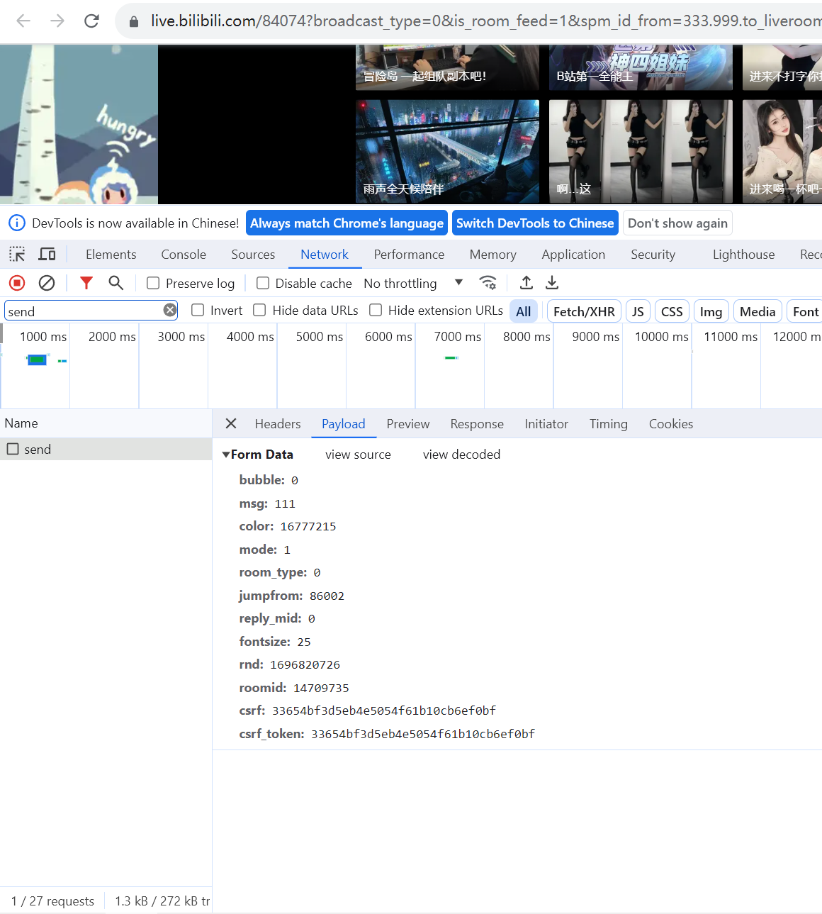

# bilibili_liveStream
B站直播间说书人脚本，脚本挂载后可实现开播，脚本自动执行并发送邮件通知，下播后自动终止发送邮件通知

敏感信息通过txt文件读取，book.txt是想要说的书，cookie.txt是B站用户信息，password.txt是邮箱smtp服务的密码。

send函数里的data字典，需要在直播间手动发送一条弹幕，F12检查

cookie是在Headers里最长的那个，注意：cookie保存了个人信息，不要随便泄露