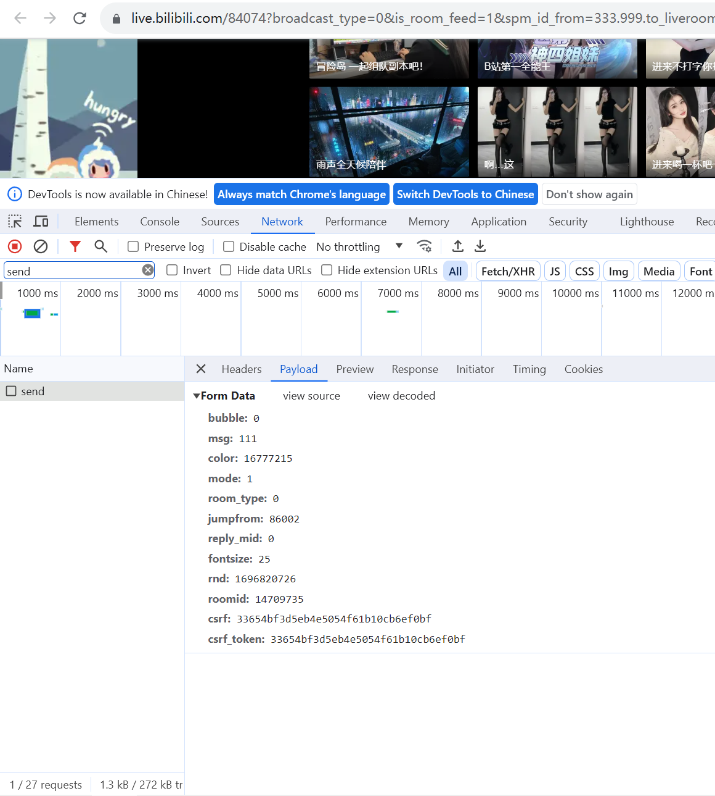

# bilibili_liveStream

### 脚本长时间运行出现问题，cookie与csrf_token需要定时与B站同步，长时间挂载后会返回 ‘账号未登录’ 无法发送弹幕，后续看看是否有解决办法

B站直播间说书人脚本，脚本挂载后可实现开播，脚本自动执行并发送邮件通知，下播后自动终止发送邮件通知

执行 pip install requests 安装唯一的第三方库

直播间的房间号在 mine/request_mine.py 设置，可以为短号也可以为长号

敏感信息通过 txt 文件夹读取，txt/book.txt 是想要说的书，txt/cookie.txt 是 B站用户信息，txt/password.txt 是邮箱 smtp服务的密码。（！！注意项目里并没有相关的txt文件夹！！）

send 函数里的 data字典，需要在直播间手动发送一条弹幕，F12检查

cookie是在Headers里最长的那个，注意：cookie保存了个人信息，不要随便泄露

