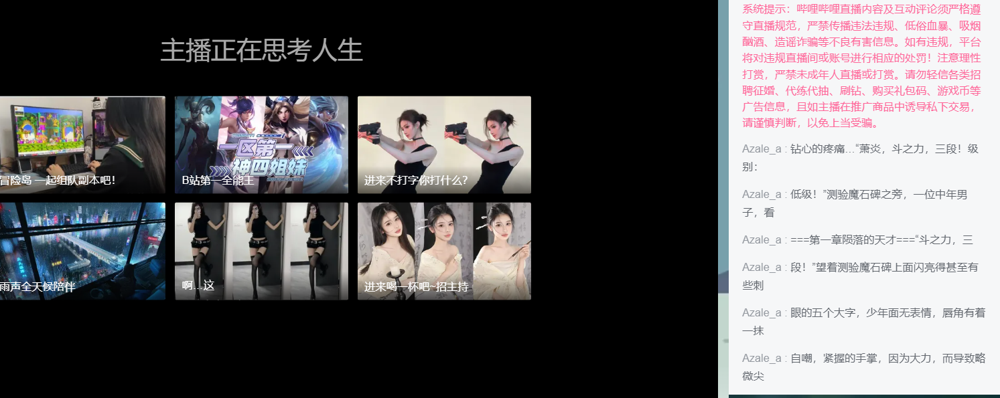

# bilibili_liveStream

```
脚本长时间运行出现问题，cookie与csrf_token需要定时与B站同步，

长时间挂载后api的response会返回 ‘账号未登录’、 ‘csrf验证失败’等异常无法通过api发送弹幕。

‘被b站后台禁言’这个报错好像是B站后台检测到api调用频繁，封禁。后续看看是否有解决办法
```
<br>

```
解决办法：
    检测每次返回的response.text的code，
    
    如果发送失败会发送异常通知并终止脚本，需要手动同步cookie与csrf_token。
    
    ‘被b站后台禁言’这个报错无法解决，但是奇怪的是等几天就正常了，暂停脚本半天。
``` 

### 注意：如果你的账号被直播间房管封禁，弹幕发送的api是不会异常的，但是弹幕不会显示

_____

B站直播间说书人脚本，脚本挂载后可实现开播，脚本自动执行并发送邮件通知，下播后自动终止发送邮件通知

执行 ```pip install requests``` 安装唯一的第三方库

直播间的房间号在 ```mine/request_mine.py``` 设置，可以为短号也可以为长号

敏感信息通过 ```txt``` 文件夹读取

```txt/book.txt``` 是想要说的书，

```txt/cookie.txt``` 是 B站用户信息，

```txt/password.txt``` 是邮箱 smtp服务的密码。

#### 注意项目里并没有相关的txt文件夹

```send``` 函数里的 ``data```字典，需要在直播间手动发送一条弹幕，```F12```检查


cookie是在Headers里最长的那个，注意：cookie保存了个人信息，不要随便泄露


